# RideTribe Context Diagram Documentation

## Overview
This document provides the context diagram details for the RideTribe travel companion application, showing external systems, users, data flows, and system boundaries.

## System Context Diagram

### External Actors (Users)

1. **Travelers**
   - Primary users who create and join trips
   - Manage expenses and communicate with trip members
   - Submit reviews and reports
   - Use social features

2. **Administrators**
   - Manage user accounts and moderation
   - Handle KYC verification
   - Monitor system health and reports
   - Manage content and resolve disputes

3. **Guest Users**
   - Browse public trips without registration
   - View trip details and user profiles
   - Access limited features

### External Systems

1. **Authentication Services**
   - Email verification system
   - Password reset service
   - OAuth providers (Google, Facebook, Apple)

2. **Payment Processing**
   - Stripe/PayPal for expense settlements
   - Digital wallet integrations
   - Bank transfer services

3. **Communication Services**
   - Email service (SendGrid, AWS SES)
   - SMS service (Twilio, AWS SNS)
   - Push notification service (Firebase, OneSignal)

4. **File Storage**
   - AWS S3 / Google Cloud Storage
   - Image processing service
   - Document storage for KYC

5. **Maps & Location Services**
   - Google Maps API
   - Geocoding services
   - Location-based trip discovery

6. **Social Media Integration**
   - Instagram API for profile linking
   - Social sharing capabilities
   - Social login providers

7. **Analytics & Monitoring**
   - Google Analytics
   - Error tracking (Sentry)
   - Performance monitoring

## Data Flow Context Diagram

```plantuml
@startuml RideTribe Context Diagram

!define EXTERNAL_ACTOR actor
!define EXTERNAL_SYSTEM rectangle
!define DATA_STORE database
!define PROCESS rectangle

' External Actors
EXTERNAL_ACTOR Travelers as "👥 Travelers"
EXTERNAL_ACTOR Administrators as "👨‍💼 Administrators"
EXTERNAL_ACTOR GuestUsers as "👤 Guest Users"

' External Systems
EXTERNAL_SYSTEM AuthServices as "🔐 Authentication Services\n• Email verification\n• Password reset\n• OAuth providers"
EXTERNAL_SYSTEM PaymentServices as "💳 Payment Processing\n• Stripe/PayPal\n• Digital wallets\n• Bank transfers"
EXTERNAL_SYSTEM CommunicationServices as "📧 Communication Services\n• Email (SendGrid)\n• SMS (Twilio)\n• Push notifications"
EXTERNAL_SYSTEM FileStorage as "📁 File Storage\n• AWS S3\n• Image processing\n• Document storage"
EXTERNAL_SYSTEM LocationServices as "🗺️ Location Services\n• Google Maps API\n• Geocoding\n• Location discovery"
EXTERNAL_SYSTEM SocialMedia as "📱 Social Media\n• Instagram API\n• Social sharing\n• Social login"
EXTERNAL_SYSTEM AnalyticsServices as "📊 Analytics & Monitoring\n• Google Analytics\n• Error tracking\n• Performance monitoring"

' Core System
rectangle "RideTribe Application" as RideTribe {
  PROCESS UserManagement as "👤 User Management\n• Registration\n• Profile management\n• KYC verification"
  PROCESS TripManagement as "✈️ Trip Management\n• Trip creation\n• Member management\n• Trip discovery"
  PROCESS ExpenseManagement as "💰 Expense Management\n• Expense tracking\n• Split calculations\n• Settlement processing"
  PROCESS Communication as "💬 Communication\n• Chat system\n• Notifications\n• Social features"
  PROCESS ReviewSystem as "⭐ Review System\n• User reviews\n• Trip reviews\n• Rating calculations"
  PROCESS Moderation as "🛡️ Moderation\n• Content filtering\n• User reports\n• Admin actions"
  
  DATA_STORE Database as "🗄️ MongoDB Database\n• Users\n• Trips\n• Expenses\n• Messages\n• Reviews\n• Notifications"
}

' Data Flows - Travelers
Travelers --> UserManagement : "Register, Login, Update Profile"
Travelers --> TripManagement : "Create/Join Trips, Browse Trips"
Travelers --> ExpenseManagement : "Add Expenses, Split Bills, Settle"
Travelers --> Communication : "Send Messages, Chat, Social"
Travelers --> ReviewSystem : "Submit Reviews, Rate Users/Trips"
Travelers --> Moderation : "Report Users/Content"

' Data Flows - Administrators
Administrators --> UserManagement : "Verify KYC, Manage Users"
Administrators --> Moderation : "Review Reports, Take Actions"
Administrators --> TripManagement : "Monitor Trips, Handle Issues"
Administrators --> ReviewSystem : "Moderate Reviews"

' Data Flows - Guest Users
GuestUsers --> TripManagement : "Browse Public Trips"
GuestUsers --> UserManagement : "View Public Profiles"

' External System Integrations
AuthServices <--> UserManagement : "Authentication, Verification"
PaymentServices <--> ExpenseManagement : "Payment Processing"
CommunicationServices <--> Communication : "Notifications, Messages"
FileStorage <--> UserManagement : "Profile Images, KYC Documents"
FileStorage <--> TripManagement : "Trip Images"
FileStorage <--> Communication : "Message Attachments"
LocationServices <--> TripManagement : "Location Data, Maps"
LocationServices <--> ExpenseManagement : "Expense Location"
SocialMedia <--> UserManagement : "Social Login, Profile Linking"
SocialMedia <--> Communication : "Social Sharing"
AnalyticsServices <--> RideTribe : "Usage Analytics, Monitoring"

' Database Connections
UserManagement --> Database
TripManagement --> Database
ExpenseManagement --> Database
Communication --> Database
ReviewSystem --> Database
Moderation --> Database

@enduml
```

## Detailed System Components

### 1. User Management System
**Purpose**: Handle user registration, authentication, and profile management

**External Dependencies**:
- Authentication services for login/registration
- File storage for profile images and KYC documents
- Social media APIs for social login
- Email/SMS services for verification

**Data Flows**:
- User registration → Email verification → Account activation
- Profile updates → File storage for images
- KYC submission → Document verification → Status update
- Password reset → Email/SMS → Token validation

### 2. Trip Management System
**Purpose**: Manage trip creation, discovery, and member coordination

**External Dependencies**:
- Location services for trip discovery and mapping
- File storage for trip images
- Communication services for trip notifications

**Data Flows**:
- Trip creation → Location validation → Public/private listing
- Trip discovery → Location-based search → Results filtering
- Member management → Invitation system → Join/leave handling

### 3. Expense Management System
**Purpose**: Track shared expenses and handle settlements

**External Dependencies**:
- Payment processing for settlements
- Location services for expense location tracking
- Communication services for expense notifications

**Data Flows**:
- Expense creation → Split calculation → Member notifications
- Settlement processing → Payment gateway → Transaction confirmation
- Expense tracking → Analytics → Reporting

### 4. Communication System
**Purpose**: Handle real-time messaging and notifications

**External Dependencies**:
- Communication services for notifications
- File storage for message attachments
- Social media for sharing

**Data Flows**:
- Message sending → Real-time delivery → Read receipts
- Notification generation → Multi-channel delivery → User preferences
- File sharing → Storage upload → Link generation

### 5. Review System
**Purpose**: Manage user and trip reviews

**External Dependencies**:
- Communication services for review notifications
- Moderation system for content filtering

**Data Flows**:
- Review submission → Content validation → Rating calculation
- Review moderation → Admin review → Approval/rejection
- Rating aggregation → User profile updates

### 6. Moderation System
**Purpose**: Handle content moderation and user reports

**External Dependencies**:
- Communication services for admin notifications
- Analytics services for monitoring

**Data Flows**:
- Report submission → Severity assessment → Admin notification
- Content review → Action determination → User notification
- Moderation tracking → Analytics → Trend analysis

## Security Context

### Authentication & Authorization
- JWT-based authentication
- Role-based access control (traveler/admin)
- Session management
- API rate limiting

### Data Protection
- Encrypted data transmission (HTTPS)
- Password hashing (bcrypt)
- Sensitive data encryption at rest
- GDPR compliance measures

### Privacy Controls
- User consent management
- Data retention policies
- Right to be forgotten
- Privacy settings for user profiles

## Performance Context

### Scalability Considerations
- Horizontal scaling for user growth
- Database sharding strategies
- CDN for static content
- Load balancing for API requests

### Monitoring & Analytics
- Real-time performance monitoring
- User behavior analytics
- Error tracking and alerting
- Business metrics tracking

## Integration Points

### Third-Party APIs
1. **Google Maps API**
   - Trip location mapping
   - Geocoding for addresses
   - Distance calculations

2. **Stripe API**
   - Payment processing
   - Subscription management
   - Refund handling

3. **SendGrid API**
   - Transactional emails
   - Email templates
   - Delivery tracking

4. **Twilio API**
   - SMS notifications
   - Phone verification
   - Emergency communications

5. **Firebase**
   - Push notifications
   - Real-time messaging
   - Analytics

### Data Exchange Formats
- **REST APIs**: JSON-based communication
- **WebSocket**: Real-time messaging
- **File Uploads**: Multipart form data
- **Webhooks**: Event notifications

## Error Handling Context

### System Failures
- Graceful degradation for external service failures
- Retry mechanisms for transient failures
- Circuit breaker patterns for external APIs
- Fallback options for critical services

### User Experience
- Clear error messages
- Recovery suggestions
- Offline functionality where possible
- Progressive enhancement

## Compliance Context

### Regulatory Requirements
- **GDPR**: Data protection and privacy
- **PCI DSS**: Payment card security
- **SOC 2**: Security and availability
- **Local Laws**: Country-specific regulations

### Industry Standards
- **OAuth 2.0**: Authentication standards
- **REST API**: Communication standards
- **JSON Schema**: Data validation
- **OpenAPI**: API documentation

---

*This context diagram should be updated when new external systems are integrated or system boundaries change.*
