# RideTribe DFD Level 1 Documentation

## Overview
This document provides the Data Flow Diagram (DFD) Level 1 details for the RideTribe application, showing the major processes, data stores, external entities, and data flows within the system.

## DFD Level 1 Diagram

### External Entities
1. **Travelers** - Primary users of the system
2. **Administrators** - System managers and moderators
3. **Guest Users** - Limited access users
4. **External Services** - Third-party integrations

### Major Processes (Level 1)
1. **User Management Process**
2. **Trip Management Process**
3. **Expense Management Process**
4. **Communication Process**
5. **Review Management Process**
6. **Moderation Process**
7. **Notification Process**

### Data Stores
1. **Users Database**
2. **Trips Database**
3. **Expenses Database**
4. **Messages Database**
5. **Reviews Database**
6. **Notifications Database**
7. **Flags Database**
8. **Posts Database**
9. **Comments Database**
10. **AdminLogs Database**

## Detailed DFD Level 1

```plantuml
@startuml RideTribe DFD Level 1

!define EXTERNAL_ENTITY rectangle
!define PROCESS rectangle
!define DATA_STORE database
!define DATA_FLOW arrow

' External Entities
EXTERNAL_ENTITY Travelers as "👥 Travelers"
EXTERNAL_ENTITY Administrators as "👨‍💼 Administrators"
EXTERNAL_ENTITY GuestUsers as "👤 Guest Users"
EXTERNAL_ENTITY ExternalServices as "🔗 External Services\n• Payment Gateways\n• Email/SMS\n• File Storage\n• Maps API"

' Major Processes
PROCESS P1 as "1.0\nUser Management\nProcess"
PROCESS P2 as "2.0\nTrip Management\nProcess"
PROCESS P3 as "3.0\nExpense Management\nProcess"
PROCESS P4 as "4.0\nCommunication\nProcess"
PROCESS P5 as "5.0\nReview Management\nProcess"
PROCESS P6 as "6.0\nModeration\nProcess"
PROCESS P7 as "7.0\nNotification\nProcess"

' Data Stores
DATA_STORE D1 as "D1\nUsers"
DATA_STORE D2 as "D2\nTrips"
DATA_STORE D3 as "D3\nExpenses"
DATA_STORE D4 as "D4\nMessages"
DATA_STORE D5 as "D5\nReviews"
DATA_STORE D6 as "D6\nNotifications"
DATA_STORE D7 as "D7\nFlags"
DATA_STORE D8 as "D8\nPosts"
DATA_STORE D9 as "D9\nComments"
DATA_STORE D10 as "D10\nAdminLogs"

' Data Flows from External Entities to Processes
Travelers --> P1 : "Registration, Login, Profile Updates"
Travelers --> P2 : "Trip Creation, Join Requests, Trip Browsing"
Travelers --> P3 : "Expense Entry, Settlement Requests"
Travelers --> P4 : "Message Sending, Chat Participation"
Travelers --> P5 : "Review Submission, Rating"
Travelers --> P6 : "Report Submission"

Administrators --> P1 : "KYC Verification, User Management"
Administrators --> P6 : "Content Moderation, Action Taking"
Administrators --> P2 : "Trip Monitoring, Issue Resolution"
Administrators --> P5 : "Review Moderation"

GuestUsers --> P2 : "Trip Browsing (Read-only)"
GuestUsers --> P1 : "Profile Viewing (Read-only)"

ExternalServices --> P1 : "Authentication, File Storage"
ExternalServices --> P3 : "Payment Processing"
ExternalServices --> P4 : "Communication Services"
ExternalServices --> P2 : "Location Services"

' Data Flows from Processes to External Entities
P1 --> ExternalServices : "Authentication Requests, File Uploads"
P3 --> ExternalServices : "Payment Requests"
P4 --> ExternalServices : "Communication Requests"
P2 --> ExternalServices : "Location Requests"
P7 --> ExternalServices : "Notification Delivery"

' Data Flows between Processes and Data Stores
P1 <--> D1 : "User CRUD Operations"
P1 <--> D10 : "Admin Actions Logging"

P2 <--> D2 : "Trip CRUD Operations"
P2 <--> D1 : "User-Trip Relationships"
P2 <--> D4 : "Trip Chat Messages"

P3 <--> D3 : "Expense CRUD Operations"
P3 <--> D2 : "Trip-Expense Relationships"
P3 <--> D1 : "User-Expense Relationships"
P3 <--> D4 : "Expense Messages"

P4 <--> D4 : "Message CRUD Operations"
P4 <--> D1 : "User Communication Data"
P4 <--> D2 : "Trip Communication Data"

P5 <--> D5 : "Review CRUD Operations"
P5 <--> D1 : "User Review Data"
P5 <--> D2 : "Trip Review Data"

P6 <--> D7 : "Flag CRUD Operations"
P6 <--> D1 : "User Moderation Data"
P6 <--> D2 : "Trip Moderation Data"
P6 <--> D5 : "Review Moderation Data"
P6 <--> D8 : "Post Moderation Data"
P6 <--> D10 : "Moderation Actions Logging"

P7 <--> D6 : "Notification CRUD Operations"
P7 <--> D1 : "User Notification Preferences"

' Additional Data Stores for Social Features
P4 <--> D8 : "Post CRUD Operations"
P4 <--> D9 : "Comment CRUD Operations"
P4 <--> D1 : "User Social Data"

@enduml
```

## Process Details

### 1.0 User Management Process
**Purpose**: Handle all user-related operations including registration, authentication, profile management, and KYC verification.

**Inputs**:
- User registration data from Travelers
- Profile update requests from Travelers
- KYC documents from Travelers
- Admin actions from Administrators

**Processes**:
- User registration and validation
- Authentication and session management
- Profile creation and updates
- KYC document processing
- User status management
- Admin user management

**Outputs**:
- User records to Users Database
- Admin action logs to AdminLogs Database
- Authentication responses to External Services
- File uploads to External Services

**Data Stores Used**:
- D1 (Users) - Primary user data
- D10 (AdminLogs) - Admin action tracking

### 2.0 Trip Management Process
**Purpose**: Manage trip creation, discovery, member management, and trip-related operations.

**Inputs**:
- Trip creation requests from Travelers
- Trip join requests from Travelers
- Trip browsing requests from Guest Users
- Location data from External Services

**Processes**:
- Trip creation and validation
- Trip discovery and search
- Member invitation and management
- Trip status management
- Location-based trip filtering
- Trip privacy management

**Outputs**:
- Trip records to Trips Database
- User-trip relationships to Users Database
- Trip chat messages to Messages Database
- Location requests to External Services

**Data Stores Used**:
- D2 (Trips) - Primary trip data
- D1 (Users) - User-trip relationships
- D4 (Messages) - Trip communication

### 3.0 Expense Management Process
**Purpose**: Handle expense tracking, splitting, and settlement processing.

**Inputs**:
- Expense entry from Travelers
- Settlement requests from Travelers
- Payment data from External Services
- Location data from External Services

**Processes**:
- Expense creation and validation
- Expense splitting calculations
- Settlement processing
- Payment integration
- Expense categorization
- Receipt management

**Outputs**:
- Expense records to Expenses Database
- Trip-expense relationships to Trips Database
- User-expense relationships to Users Database
- Expense messages to Messages Database
- Payment requests to External Services

**Data Stores Used**:
- D3 (Expenses) - Primary expense data
- D2 (Trips) - Trip-expense relationships
- D1 (Users) - User-expense relationships
- D4 (Messages) - Expense communication

### 4.0 Communication Process
**Purpose**: Manage real-time messaging, chat functionality, and social features.

**Inputs**:
- Messages from Travelers
- Chat participation requests from Travelers
- Social posts from Travelers
- Comments from Travelers

**Processes**:
- Message sending and delivery
- Chat room management
- Real-time communication
- Social post creation
- Comment management
- File sharing

**Outputs**:
- Messages to Messages Database
- User communication data to Users Database
- Trip communication data to Trips Database
- Posts to Posts Database
- Comments to Comments Database
- Communication requests to External Services

**Data Stores Used**:
- D4 (Messages) - Primary message data
- D1 (Users) - User communication data
- D2 (Trips) - Trip communication data
- D8 (Posts) - Social posts
- D9 (Comments) - Post comments

### 5.0 Review Management Process
**Purpose**: Handle user and trip reviews, ratings, and feedback management.

**Inputs**:
- Review submissions from Travelers
- Rating data from Travelers
- Moderation actions from Administrators

**Processes**:
- Review creation and validation
- Rating calculation and aggregation
- Review moderation
- Content filtering
- Review analytics

**Outputs**:
- Reviews to Reviews Database
- User review data to Users Database
- Trip review data to Trips Database
- Moderation actions to Moderation Process

**Data Stores Used**:
- D5 (Reviews) - Primary review data
- D1 (Users) - User review data
- D2 (Trips) - Trip review data

### 6.0 Moderation Process
**Purpose**: Handle content moderation, user reports, and administrative actions.

**Inputs**:
- Report submissions from Travelers
- Content for moderation from all processes
- Admin actions from Administrators

**Processes**:
- Report processing and assessment
- Content moderation and filtering
- User action management
- Content approval/rejection
- Moderation analytics

**Outputs**:
- Flags to Flags Database
- User moderation data to Users Database
- Trip moderation data to Trips Database
- Review moderation data to Reviews Database
- Post moderation data to Posts Database
- Moderation actions to AdminLogs Database

**Data Stores Used**:
- D7 (Flags) - Primary flag data
- D1 (Users) - User moderation data
- D2 (Trips) - Trip moderation data
- D5 (Reviews) - Review moderation data
- D8 (Posts) - Post moderation data
- D10 (AdminLogs) - Moderation action logs

### 7.0 Notification Process
**Purpose**: Manage all system notifications and user communication preferences.

**Inputs**:
- Notification triggers from all processes
- User preferences from Users Database
- Communication requests from External Services

**Processes**:
- Notification generation
- User preference management
- Multi-channel delivery
- Notification scheduling
- Delivery tracking

**Outputs**:
- Notifications to Notifications Database
- User notification preferences to Users Database
- Communication requests to External Services

**Data Stores Used**:
- D6 (Notifications) - Primary notification data
- D1 (Users) - User notification preferences

## Data Flow Patterns

### User-Centric Flows
1. **Registration Flow**: Travelers → P1 → D1 → External Services
2. **Trip Participation Flow**: Travelers → P2 → D2 → D1 → P4 → D4
3. **Expense Management Flow**: Travelers → P3 → D3 → D2 → P7 → D6

### Admin-Centric Flows
1. **Moderation Flow**: Administrators → P6 → D7 → D10
2. **User Management Flow**: Administrators → P1 → D1 → D10
3. **Content Review Flow**: P5 → P6 → D5 → D7

### System Integration Flows
1. **External Service Integration**: External Services ↔ P1, P2, P3, P4, P7
2. **Cross-Process Communication**: P1 ↔ P2 ↔ P3 ↔ P4 ↔ P5 ↔ P6 ↔ P7
3. **Data Synchronization**: All Processes ↔ Respective Data Stores

## Security and Privacy Considerations

### Data Protection
- All data flows are encrypted (HTTPS/TLS)
- Sensitive data is encrypted at rest
- User authentication required for most flows
- Role-based access control for admin flows

### Privacy Controls
- User consent management in P1
- Data retention policies across all processes
- GDPR compliance in data flows
- Anonymization for analytics

### Audit Trails
- All admin actions logged in D10
- User activity tracking across processes
- Data access logging
- Compliance reporting

## Performance Considerations

### Data Flow Optimization
- Efficient database queries and indexing
- Caching for frequently accessed data
- Asynchronous processing for notifications
- Real-time updates for critical flows

### Scalability
- Horizontal scaling for all processes
- Database sharding strategies
- Load balancing for external service calls
- CDN for static content delivery

---

*This DFD Level 1 should be updated when new processes are added or existing processes are modified.*
