# RideTribe DFD Level 1 - Focused Documentation

## Overview
This document provides a focused Data Flow Diagram (DFD) Level 1 for the RideTribe application, showing detailed data flows between the two main external entities (Travelers and Administrators) and the internal processes.

## External Entities
1. **👥 Travelers** - Primary users who create trips, manage expenses, communicate, and use all core features
2. **👨‍💼 Administrators** - System managers who handle moderation, KYC verification, and administrative tasks

## Major Processes (Level 1)
1. **1.0 User Management Process**
2. **2.0 Trip Management Process**
3. **3.0 Expense Management Process**
4. **4.0 Communication Process**
5. **5.0 Review Management Process**
6. **6.0 Moderation Process**
7. **7.0 Notification Process**

## Data Stores
- **D1 Users** - User profiles, authentication, preferences
- **D2 Trips** - Trip information, members, status
- **D3 Expenses** - Expense tracking, splits, settlements
- **D4 Messages** - Chat messages, attachments
- **D5 Reviews** - User and trip reviews, ratings
- **D6 Notifications** - System notifications
- **D7 Flags** - Reports, moderation data
- **D8 Posts** - Social feed posts
- **D9 Comments** - Post comments
- **D10 AdminLogs** - Administrative action logs

## Detailed DFD Level 1 with Focused Data Flows

```plantuml
@startuml RideTribe DFD Level 1 - Focused

!define EXTERNAL_ENTITY actor
!define PROCESS rectangle
!define DATA_STORE database

' External Entities
EXTERNAL_ENTITY Travelers as "👥 Travelers"
EXTERNAL_ENTITY Administrators as "👨‍💼 Administrators"

' Major Processes
PROCESS P1 as "1.0\nUser Management\nProcess"
PROCESS P2 as "2.0\nTrip Management\nProcess"
PROCESS P3 as "3.0\nExpense Management\nProcess"
PROCESS P4 as "4.0\nCommunication\nProcess"
PROCESS P5 as "5.0\nReview Management\nProcess"
PROCESS P6 as "6.0\nModeration\nProcess"
PROCESS P7 as "7.0\nNotification\nProcess"

' Data Stores
DATA_STORE D1 as "D1\nUsers"
DATA_STORE D2 as "D2\nTrips"
DATA_STORE D3 as "D3\nExpenses"
DATA_STORE D4 as "D4\nMessages"
DATA_STORE D5 as "D5\nReviews"
DATA_STORE D6 as "D6\nNotifications"
DATA_STORE D7 as "D7\nFlags"
DATA_STORE D8 as "D8\nPosts"
DATA_STORE D9 as "D9\nComments"
DATA_STORE D10 as "D10\nAdminLogs"

' ===== TRAVELERS DATA FLOWS =====

' Travelers to User Management
Travelers --> P1 : "1.1 Registration Data\n• Name, Email, Password\n• Phone, Gender, Preferences\n• Profile Image, Bio"
Travelers --> P1 : "1.2 Login Credentials\n• Email/Username\n• Password"
Travelers --> P1 : "1.3 Profile Updates\n• Personal Information\n• Preferences\n• Profile/Cover Images"
Travelers --> P1 : "1.4 KYC Documents\n• ID Document\n• Selfie Photo\n• Verification Request"

' Travelers to Trip Management
Travelers --> P2 : "2.1 Trip Creation\n• Destination, Dates\n• Budget, Trip Type\n• Description, Privacy Settings\n• Location Coordinates"
Travelers --> P2 : "2.2 Trip Join Requests\n• Trip ID\n• Join Request"
Travelers --> P2 : "2.3 Trip Browsing\n• Search Criteria\n• Location Filters\n• Date Ranges"
Travelers --> P2 : "2.4 Trip Updates\n• Trip Modifications\n• Member Management\n• Status Changes"

' Travelers to Expense Management
Travelers --> P3 : "3.1 Expense Entry\n• Amount, Description\n• Category, Currency\n• Receipt Image\n• Split Preferences"
Travelers --> P3 : "3.2 Settlement Requests\n• Payment Requests\n• Settlement Method\n• Amount Details"
Travelers --> P3 : "3.3 Expense Updates\n• Expense Modifications\n• Receipt Updates\n• Split Adjustments"

' Travelers to Communication
Travelers --> P4 : "4.1 Message Sending\n• Text Messages\n• File Attachments\n• Location Sharing\n• Expense Links"
Travelers --> P4 : "4.2 Chat Participation\n• Join Chat Rooms\n• Leave Chat Rooms\n• Chat Settings"
Travelers --> P4 : "4.3 Social Posts\n• Post Content\n• Audience Settings\n• Post Images"
Travelers --> P4 : "4.4 Comments\n• Comment Text\n• Post References"

' Travelers to Review Management
Travelers --> P5 : "5.1 Review Submission\n• Rating (1-5)\n• Feedback Text\n• Review Type (Trip/User)\n• Tags"
Travelers --> P5 : "5.2 Review Updates\n• Rating Changes\n• Feedback Modifications"

' Travelers to Moderation
Travelers --> P6 : "6.1 Report Submission\n• Report Type (User/Trip/Review/Post)\n• Reason for Report\n• Additional Details\n• Evidence"

' ===== ADMINISTRATORS DATA FLOWS =====

' Administrators to User Management
Administrators --> P1 : "1.5 KYC Verification\n• Verification Decision\n• Approval/Rejection\n• Admin Notes"
Administrators --> P1 : "1.6 User Management\n• User Status Changes\n• Account Suspension\n• User Deletion\n• Role Assignment"

' Administrators to Trip Management
Administrators --> P2 : "2.5 Trip Monitoring\n• Trip Status Changes\n• Issue Resolution\n• Trip Suspension"

' Administrators to Review Management
Administrators --> P5 : "5.3 Review Moderation\n• Review Approval/Rejection\n• Content Moderation\n• Admin Response"

' Administrators to Moderation
Administrators --> P6 : "6.2 Content Moderation\n• Flag Resolution\n• Action Decisions\n• User Actions\n• Content Removal"
Administrators --> P6 : "6.3 System Monitoring\n• Moderation Analytics\n• Trend Analysis\n• Policy Updates"

' ===== PROCESS TO DATA STORE FLOWS =====

' User Management Data Flows
P1 <--> D1 : "User CRUD Operations\n• Create/Read/Update/Delete Users\n• Authentication Data\n• Profile Information\n• KYC Status"
P1 <--> D10 : "Admin Action Logging\n• KYC Decisions\n• User Management Actions\n• System Changes"

' Trip Management Data Flows
P2 <--> D2 : "Trip CRUD Operations\n• Create/Read/Update/Delete Trips\n• Trip Status Management\n• Member Relationships"
P2 <--> D1 : "User-Trip Relationships\n• Trip Memberships\n• Creator Information\n• Join Requests"
P2 <--> D4 : "Trip Communication\n• Trip Chat Messages\n• Trip Notifications"

' Expense Management Data Flows
P3 <--> D3 : "Expense CRUD Operations\n• Create/Read/Update/Delete Expenses\n• Split Calculations\n• Settlement Tracking"
P3 <--> D2 : "Trip-Expense Relationships\n• Trip Expense Lists\n• Expense Categories"
P3 <--> D1 : "User-Expense Relationships\n• Expense Contributors\n• Split Participants"
P3 <--> D4 : "Expense Communication\n• Expense Messages\n• Settlement Notifications"

' Communication Data Flows
P4 <--> D4 : "Message CRUD Operations\n• Create/Read/Update/Delete Messages\n• Message Status\n• Attachments"
P4 <--> D1 : "User Communication Data\n• Chat Participants\n• Message Senders"
P4 <--> D2 : "Trip Communication Data\n• Trip Chat Rooms\n• Trip Messages"
P4 <--> D8 : "Post CRUD Operations\n• Create/Read/Update/Delete Posts\n• Post Analytics"
P4 <--> D9 : "Comment CRUD Operations\n• Create/Read/Update/Delete Comments\n• Comment Threads"

' Review Management Data Flows
P5 <--> D5 : "Review CRUD Operations\n• Create/Read/Update/Delete Reviews\n• Review Status\n• Moderation Data"
P5 <--> D1 : "User Review Data\n• User Ratings\n• Review History\n• Average Ratings"
P5 <--> D2 : "Trip Review Data\n• Trip Ratings\n• Trip Reviews\n• Review Analytics"

' Moderation Data Flows
P6 <--> D7 : "Flag CRUD Operations\n• Create/Read/Update/Delete Flags\n• Flag Status\n• Resolution Data"
P6 <--> D1 : "User Moderation Data\n• User Status\n• Warning History\n• Moderation Actions"
P6 <--> D2 : "Trip Moderation Data\n• Trip Status\n• Trip Moderation\n• Suspension Data"
P6 <--> D5 : "Review Moderation Data\n• Review Status\n• Moderation Actions\n• Admin Responses"
P6 <--> D8 : "Post Moderation Data\n• Post Status\n• Content Moderation\n• Removal Actions"
P6 <--> D10 : "Moderation Action Logging\n• Admin Decisions\n• Action History\n• Policy Changes"

' Notification Data Flows
P7 <--> D6 : "Notification CRUD Operations\n• Create/Read/Update/Delete Notifications\n• Delivery Status\n• User Preferences"
P7 <--> D1 : "User Notification Preferences\n• Notification Settings\n• Delivery Methods\n• Opt-in/Out"

' ===== CROSS-PROCESS DATA FLOWS =====

' Notification Triggers
P1 --> P7 : "User Action Notifications\n• Registration Confirmations\n• KYC Status Updates\n• Account Changes"
P2 --> P7 : "Trip Notifications\n• Trip Invitations\n• Trip Updates\n• Member Changes"
P3 --> P7 : "Expense Notifications\n• Expense Added\n• Settlement Requests\n• Payment Confirmations"
P4 --> P7 : "Communication Notifications\n• New Messages\n• Chat Invitations\n• Social Interactions"
P5 --> P7 : "Review Notifications\n• Review Received\n• Rating Updates\n• Moderation Actions"
P6 --> P7 : "Moderation Notifications\n• Report Status\n• Action Taken\n• Warning Notifications"

' Moderation Triggers
P1 --> P6 : "User Moderation Triggers\n• KYC Verification\n• Account Issues\n• Policy Violations"
P2 --> P6 : "Trip Moderation Triggers\n• Trip Reports\n• Content Issues\n• Safety Concerns"
P4 --> P6 : "Communication Moderation\n• Message Reports\n• Post Moderation\n• Comment Filtering"
P5 --> P6 : "Review Moderation\n• Review Reports\n• Content Filtering\n• Rating Validation"

@enduml
```

## Detailed Data Flow Breakdown

### 👥 TRAVELERS → PROCESSES

#### 1. Travelers → User Management Process (P1)
**1.1 Registration Data**
- Name, Email, Password
- Phone, Gender, Preferences
- Profile Image, Bio
- Date of Birth, Country

**1.2 Login Credentials**
- Email/Username
- Password
- Remember Me Option

**1.3 Profile Updates**
- Personal Information Changes
- Preference Updates
- Profile/Cover Image Uploads
- Bio and Social Links

**1.4 KYC Documents**
- ID Document Upload
- Selfie Photo
- Verification Request
- Additional Documentation

#### 2. Travelers → Trip Management Process (P2)
**2.1 Trip Creation**
- Destination, Start/End Dates
- Budget, Trip Type (carpool/rental/public)
- Description, Privacy Settings
- Location Coordinates, Images

**2.2 Trip Join Requests**
- Trip ID Selection
- Join Request Submission
- Availability Confirmation

**2.3 Trip Browsing**
- Search Criteria (location, dates, budget)
- Location Filters, Date Ranges
- Trip Type Filters, Privacy Settings

**2.4 Trip Updates**
- Trip Modifications
- Member Management (invite/remove)
- Status Changes (active/completed/cancelled)

#### 3. Travelers → Expense Management Process (P3)
**3.1 Expense Entry**
- Amount, Description
- Category (transport/accommodation/food/etc.)
- Currency, Receipt Image
- Split Preferences (auto/manual)

**3.2 Settlement Requests**
- Payment Requests
- Settlement Method (cash/transfer/app)
- Amount Details, Due Dates

**3.3 Expense Updates**
- Expense Modifications
- Receipt Updates
- Split Adjustments

#### 4. Travelers → Communication Process (P4)
**4.1 Message Sending**
- Text Messages
- File Attachments (images/documents)
- Location Sharing
- Expense Links

**4.2 Chat Participation**
- Join Chat Rooms
- Leave Chat Rooms
- Chat Settings (mute/block)

**4.3 Social Posts**
- Post Content (text/images)
- Audience Settings (worldwide/nearby)
- Post Privacy

**4.4 Comments**
- Comment Text
- Post References
- Comment Replies

#### 5. Travelers → Review Management Process (P5)
**5.1 Review Submission**
- Rating (1-5 stars)
- Feedback Text
- Review Type (Trip/User)
- Tags, Categories

**5.2 Review Updates**
- Rating Changes
- Feedback Modifications
- Review Edits

#### 6. Travelers → Moderation Process (P6)
**6.1 Report Submission**
- Report Type (User/Trip/Review/Post)
- Reason for Report
- Additional Details
- Evidence/Proof

### 👨‍💼 ADMINISTRATORS → PROCESSES

#### 1. Administrators → User Management Process (P1)
**1.5 KYC Verification**
- Verification Decision (approve/reject)
- Approval/Rejection Reasons
- Admin Notes
- Follow-up Actions

**1.6 User Management**
- User Status Changes (active/suspended/banned)
- Account Suspension/Deletion
- Role Assignment (traveler/admin)
- User Data Management

#### 2. Administrators → Trip Management Process (P2)
**2.5 Trip Monitoring**
- Trip Status Changes
- Issue Resolution
- Trip Suspension
- Safety Monitoring

#### 3. Administrators → Review Management Process (P5)
**5.3 Review Moderation**
- Review Approval/Rejection
- Content Moderation
- Admin Response
- Review Editing

#### 4. Administrators → Moderation Process (P6)
**6.2 Content Moderation**
- Flag Resolution
- Action Decisions (warn/suspend/ban)
- User Actions
- Content Removal

**6.3 System Monitoring**
- Moderation Analytics
- Trend Analysis
- Policy Updates
- System Health Monitoring

## Key Data Flow Patterns

### User Journey Flows
1. **Registration Flow**: Travelers → P1 → D1 → P7 → D6
2. **Trip Creation Flow**: Travelers → P2 → D2 → D1 → P7 → D6
3. **Expense Management Flow**: Travelers → P3 → D3 → D2 → P7 → D6
4. **Communication Flow**: Travelers → P4 → D4 → D1 → P7 → D6

### Admin Management Flows
1. **KYC Verification Flow**: Administrators → P1 → D1 → D10 → P7 → D6
2. **Moderation Flow**: Administrators → P6 → D7 → D10 → P7 → D6
3. **Content Review Flow**: P5 → P6 → D5 → D7 → D10

### Cross-Process Integration
- **Notification Triggers**: All processes → P7 → D6
- **Moderation Triggers**: All processes → P6 → D7
- **Data Synchronization**: All processes ↔ respective data stores

This focused DFD Level 1 shows the clear separation between user-facing operations (Travelers) and administrative operations (Administrators), with detailed data flows for each interaction.
